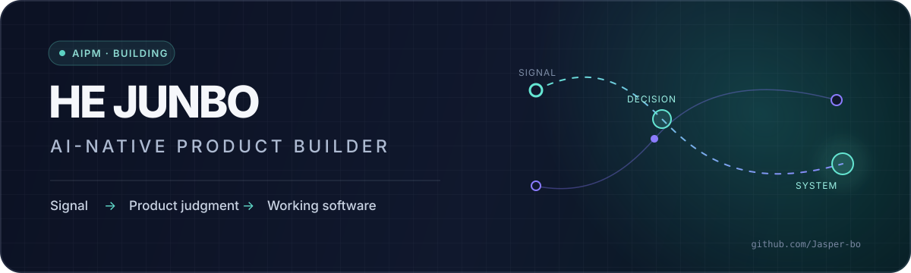

<p align="center">
  
</p>

<p align="center">
  <a href="https://jasper-bo-github-io.vercel.app">Personal site</a>
  ·
  <a href="mailto:2909066560@qq.com">Email</a>
  ·
  <a href="https://x.com/mniu61934">X / @mniu61934</a>
</p>

## Hi, I'm Junbo 👋

I'm a computer science student and an **AI-native product builder**. I turn real user signals into focused product decisions, then shorten the distance from a written idea to working software.

我是一名计算机专业学生，也是一名 AI-native 产品探索者。我关注的不是“让 AI 多生成一些东西”，而是如何用它更快地理解真实需求、收窄产品范围，并交付可以验证的产品闭环。

> **Current focus:** AI agents in product workflows, agentic commerce, and focused health software.

## Selected work

<table>
  <tr>
    <td width="50%" valign="top">
      <h3><a href="https://github.com/Jasper-bo/luckyflow-agent">☕ LuckyFlow</a></h3>
      <p>An AI Agent traffic and membership-operations proposal for Luckin Coffee. It separates deterministic commerce rules from agent reasoning and includes a white paper plus a 36-case evaluation set.</p>
      <p><code>Agentic Commerce</code> <code>Product Strategy</code> <code>Evals</code></p>
    </td>
    <td width="50%" valign="top">
      <h3><a href="https://github.com/Jasper-bo/master-your-body">🏋️ VitalPulse</a></h3>
      <p>A full-stack health tracker covering onboarding, personalized plans, food and training logs, health scoring, and a PostgreSQL-backed data loop.</p>
      <p><code>Next.js</code> <code>TypeScript</code> <code>Prisma</code> <code>PostgreSQL</code></p>
    </td>
  </tr>
  <tr>
    <td colspan="2" valign="top">
      <h3><a href="https://github.com/Jasper-bo/Jasper-bo.github.io">✦ AIPM Blog</a></h3>
      <p>A bilingual personal knowledge and project system. It turns projects, notes, books, and working methods into structured content instead of a one-off portfolio page.</p>
      <p><code>Next.js</code> <code>React</code> <code>Content Modeling</code> <code>GitHub Pages</code></p>
    </td>
  </tr>
</table>

## How I work

```text
Observe real signals → define the problem → reduce the scope
        → build a working surface → test the claim → learn and iterate
```

- Start with repeated user needs, complaints, and high-frequency tasks.
- Keep product judgment, requirements, interface, and implementation in one continuous context.
- Use deterministic systems for rules, money, permissions, and safety; use agents where goals and tool paths are genuinely uncertain.
- Prefer a small verified loop over a large untested feature list.

## Toolbox

<p>
  
  
  
  
</p>

<p>
  
  
  
  
  
  
</p>

## Open questions I'm exploring

- What product judgment becomes more valuable—not cheaper—in an AI-native workflow?
- How should brands preserve trust and customer relationships when personal agents become the interface?
- How narrow can focused software become while still creating a complete, repeatable user loop?

<p align="center">
  <sub>Build from evidence. Reduce until clear. Ship something testable.</sub>
</p>
